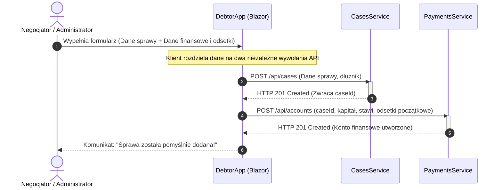

```mermaid
sequenceDiagram
    autonumber
    actor Użytkownik as Negocjator / Administrator
    participant Web as DebtorApp (Blazor)
    participant CS as CasesService
    participant PS as PaymentsService

    Użytkownik ->> Web: Wypełnia formularz (Dane sprawy + Dane finansowe i odsetki)
    
    Note over Web: Klient rozdziela dane na dwa niezależne wywołania API
    
    Web ->> CS: POST /api/cases (Dane sprawy, dłużnik)
    activate CS
    CS -->> Web: HTTP 201 Created (Zwraca caseId)
    deactivate CS

    Web ->> PS: POST /api/accounts (caseId, kapitał, stawi, odsetki początkowe)
    activate PS
    PS -->> Web: HTTP 201 Created (Konto finansowe utworzone)
    deactivate PS

    Web -->> Użytkownik: Komunikat: "Sprawa została pomyślnie dodana!"
```