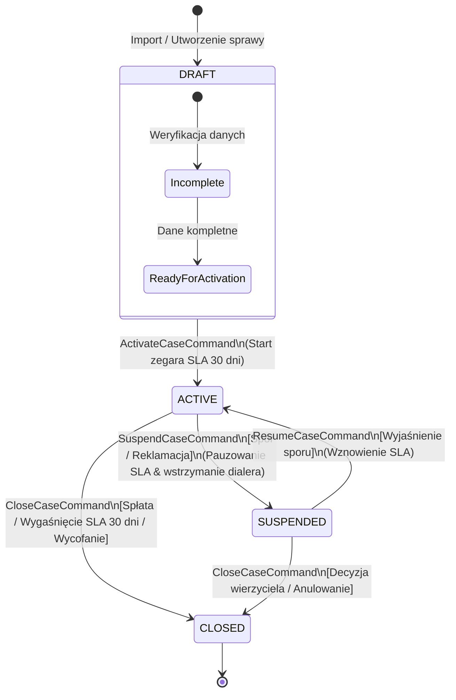
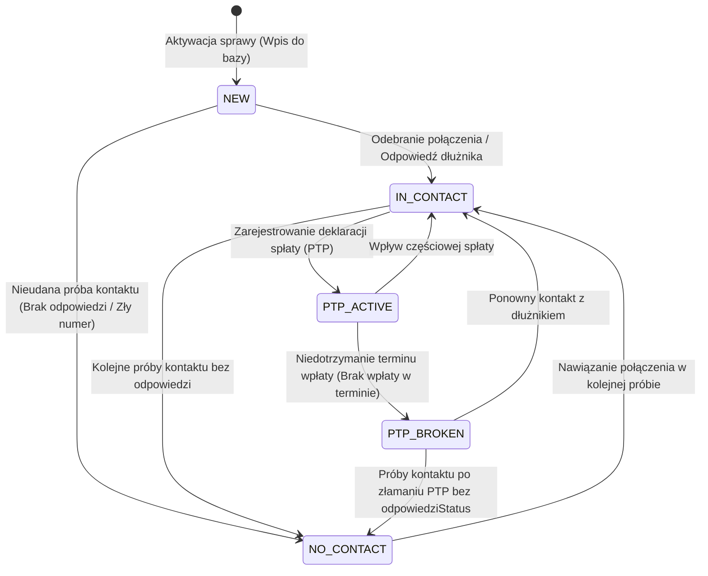

# Stan

```mermaid
stateDiagram-v2
    [*] --> DRAFT : Import / Utworzenie sprawy

    state DRAFT {
        [*] --> Incomplete : Weryfikacja danych
        Incomplete --> ReadyForActivation : Dane kompletne
    }

    DRAFT --> ACTIVE : ActivateCaseCommand\n(Start zegara SLA 30 dni)

    ACTIVE --> SUSPENDED : SuspendCaseCommand\n[Spór / Reklamacja]\n(Pauzowanie SLA & wstrzymanie dialera)
    SUSPENDED --> ACTIVE : ResumeCaseCommand\n[Wyjaśnienie sporu]\n(Wznowienie SLA)

    ACTIVE --> CLOSED : CloseCaseCommand\n[Spłata / Wygaśnięcie SLA 30 dni / Wycofanie]
    SUSPENDED --> CLOSED : CloseCaseCommand\n[Decyzja wierzyciela / Anulowanie]

    CLOSED --> [*]
```

# Status operacyjny

```mermaid
stateDiagram-v2
    [*] --> NEW : Aktywacja sprawy (Wpis do bazy)

    NEW --> IN_CONTACT : Odebranie połączenia / Odpowiedź dłużnika
    NEW --> NO_CONTACT : Nieudana próba kontaktu (Brak odpowiedzi / Zły numer)

    NO_CONTACT --> IN_CONTACT : Nawiązanie połączenia w kolejnej próbie
    IN_CONTACT --> NO_CONTACT : Kolejne próby kontaktu bez odpowiedzi

    IN_CONTACT --> PTP_ACTIVE : Zarejestrowanie deklaracji spłaty (PTP)
    
    PTP_ACTIVE --> IN_CONTACT : Wpływ częściowej spłaty
    PTP_ACTIVE --> PTP_BROKEN : Niedotrzymanie terminu wpłaty (Brak wpłaty w terminie)
    
    PTP_BROKEN --> IN_CONTACT : Ponowny kontakt z dłużnikiem
    PTP_BROKEN --> NO_CONTACT : Próby kontaktu po złamaniu PTP bez odpowiedziStatus
```