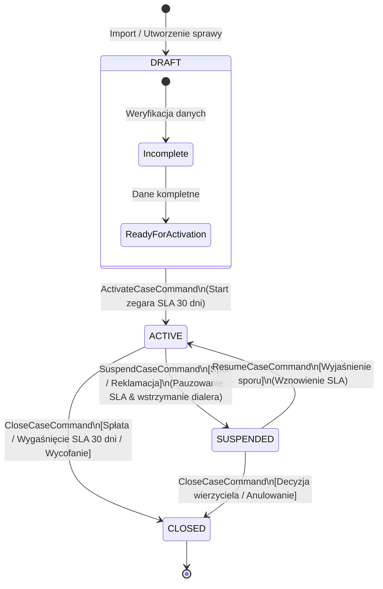
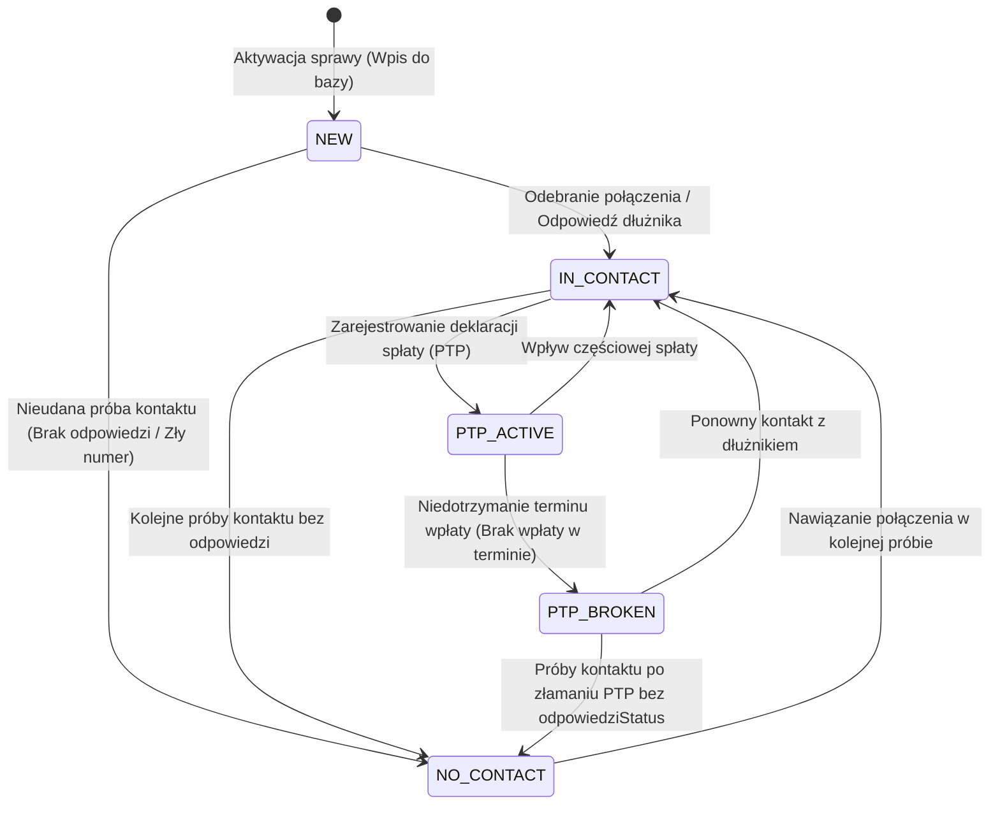
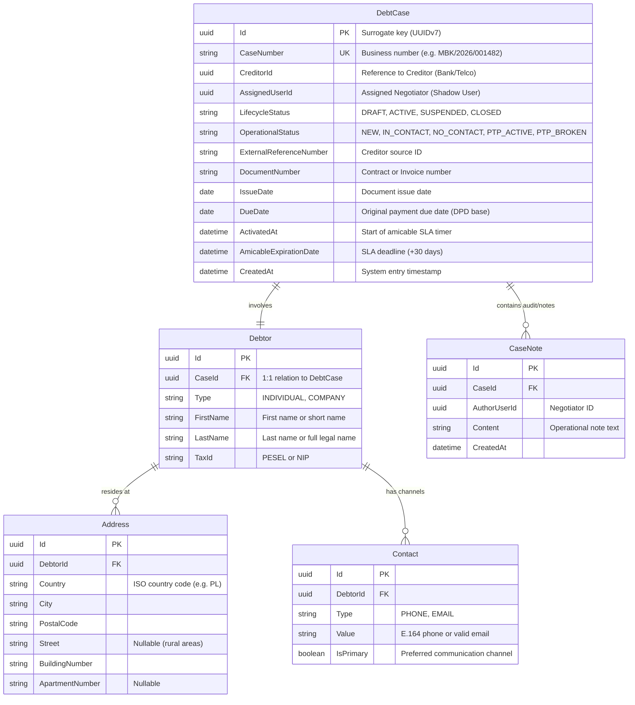

# Stan

```mermaid
stateDiagram-v2
    [*] --> DRAFT : Import / Utworzenie sprawy

    state DRAFT {
        [*] --> Incomplete : Weryfikacja danych
        Incomplete --> ReadyForActivation : Dane kompletne
    }

    DRAFT --> ACTIVE : ActivateCaseCommand\n(Start zegara SLA 30 dni)

    ACTIVE --> SUSPENDED : SuspendCaseCommand\n[Spór / Reklamacja]\n(Pauzowanie SLA & wstrzymanie dialera)
    SUSPENDED --> ACTIVE : ResumeCaseCommand\n[Wyjaśnienie sporu]\n(Wznowienie SLA)

    ACTIVE --> CLOSED : CloseCaseCommand\n[Spłata / Wygaśnięcie SLA 30 dni / Wycofanie]
    SUSPENDED --> CLOSED : CloseCaseCommand\n[Decyzja wierzyciela / Anulowanie]

    CLOSED --> [*]
```

# Status operacyjny

```mermaid
stateDiagram-v2
    [*] --> NEW : Aktywacja sprawy (Wpis do bazy)

    NEW --> IN_CONTACT : Odebranie połączenia / Odpowiedź dłużnika
    NEW --> NO_CONTACT : Nieudana próba kontaktu (Brak odpowiedzi / Zły numer)

    NO_CONTACT --> IN_CONTACT : Nawiązanie połączenia w kolejnej próbie
    IN_CONTACT --> NO_CONTACT : Kolejne próby kontaktu bez odpowiedzi

    IN_CONTACT --> PTP_ACTIVE : Zarejestrowanie deklaracji spłaty (PTP)
    
    PTP_ACTIVE --> IN_CONTACT : Wpływ częściowej spłaty
    PTP_ACTIVE --> PTP_BROKEN : Niedotrzymanie terminu wpłaty (Brak wpłaty w terminie)
    
    PTP_BROKEN --> IN_CONTACT : Ponowny kontakt z dłużnikiem
    PTP_BROKEN --> NO_CONTACT : Próby kontaktu po złamaniu PTP bez odpowiedziStatus
```

```mermaid
erDiagram
    DebtCase {
        uuid Id PK "Surrogate key (UUIDv7)"
        string CaseNumber UK "Business number (e.g. MBK/2026/001482)"
        uuid CreditorId "Reference to Creditor (Bank/Telco)"
        uuid AssignedUserId "Assigned Negotiator (Shadow User)"
        string LifecycleStatus "DRAFT, ACTIVE, SUSPENDED, CLOSED"
        string OperationalStatus "NEW, IN_CONTACT, NO_CONTACT, PTP_ACTIVE, PTP_BROKEN"
        string ExternalReferenceNumber "Creditor source ID"
        string DocumentNumber "Contract or Invoice number"
        date IssueDate "Document issue date"
        date DueDate "Original payment due date (DPD base)"
        datetime ActivatedAt "Start of amicable SLA timer"
        datetime AmicableExpirationDate "SLA deadline (+30 days)"
        datetime CreatedAt "System entry timestamp"
    }

    Debtor {
        uuid Id PK
        uuid CaseId FK "1:1 relation to DebtCase"
        string Type "INDIVIDUAL, COMPANY"
        string FirstName "First name or short name"
        string LastName "Last name or full legal name"
        string TaxId "PESEL or NIP"
    }

    Address {
        uuid Id PK
        uuid DebtorId FK
        string Country "ISO country code (e.g. PL)"
        string City
        string PostalCode
        string Street "Nullable (rural areas)"
        string BuildingNumber
        string ApartmentNumber "Nullable"
    }

    Contact {
        uuid Id PK
        uuid DebtorId FK
        string Type "PHONE, EMAIL"
        string Value "E.164 phone or valid email"
        boolean IsPrimary "Preferred communication channel"
    }

    CaseNote {
        uuid Id PK
        uuid CaseId FK
        uuid AuthorUserId "Negotiator ID"
        string Content "Operational note text"
        datetime CreatedAt
    }

    DebtCase ||--|| Debtor : "involves"
    Debtor ||--o{ Address : "resides at"
    Debtor ||--o{ Contact : "has channels"
    DebtCase ||--o{ CaseNote : "contains audit/notes"
```